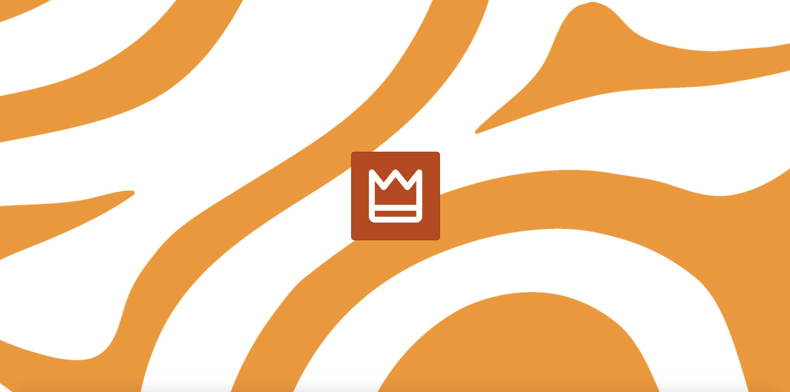

# Royal Checkbox

This checkbox was created to participate in the Community Challenge Mind Mingle. The challenge was to design the most royal checkbox possible. It was announced on the day of King's Day celebrations in the Netherlands.

## Credits

**Data Source**

- Background image sourced from Freepik (www.freepik.com) (https://www.freepik.com/free-vector/orange-irregular-organic-lines-seamless-pattern_66813905.htm#fromView=search&page=1&position=52&uuid=af0d7999-96cb-4b99-84f2-34d931c712c9)

- Audio sourced from Freesound (www.freesound.org) (https://freesound.org/people/ohforheavensake/sounds/423455/)
